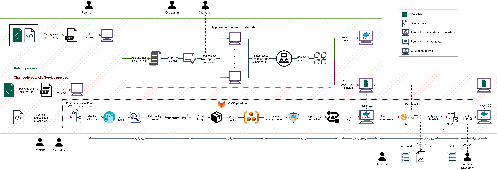

# Chaincode as a Kubernetes service (CCaaKS)

CCaaKS contains CICD pipelines to support the software life-cycle of chaincode in
Hyperledger Fabric. This document provides a comprehensive analysis on different
aspects of CCaaKS with a comparison on the existing methodology of chaincode deployment in
Hyperledger Fabric. The content is structured as follows:

- [Life-cycle of a chaincode](#life-cycle-of-a-chaincode)
- [Impact on chaincode life-cycle](#impact-on-chaincode-life-cycle)
- [Pros and cons of CCaaKS](#pros-and-cons-of-ccaaks)
- [Concerns related to CCaaKS](#concerns)

## Life-cycle of a chaincode

The following diagram illustrates how the life-cycle of a chaincode is impacted by both
the default and CCaaKS processes.

    

## Impact on chaincode life-cycle

The following table contains a summary of the key differences between 2 approaches in
terms of the chaincode life-cycle, i.e. using the default method provided by Hyperledger
Fabric vs using the CCaaKS method as proposed in this repository.

<table>
    <tbody>
        <tr align="center">
            <th align="center">Phase</th>    
            <th align="center">Common key points</th>    
            <th align="center">Default process</th>    
            <th align="center">CCaaKS</th>    
        </tr>
        <tr>
            <td align="center">Package chaincode</td>
            <td align="left">
                <ul>
                    <li>Requires tar.gz extension and specific folder structure</li>
                </ul>
            </td>
            <td align="left">
                <ul>
                    <li>Use peer binary for packaging</li>
                    <li>Package contains metadata and implementation</li>
                </ul>
            </td>
            <td align="left">
                <ul>
                    <li>Can use external tools to package as long as it adheres to the folder structure</li>
                    <li>Package contains only metadata to connect to the external chaincode</li>
                </ul>
            </td>
        </tr>
        <tr>
            <td align="center">Install chaincode</td>
            <td>
                <ul>
                    <li>Requires peer admin role</li>
                    <li>Different versions can be installed on different organizations</li>
                    <ul>
                        <li>Allows logics specific for each organization</li>
                    </ul>
                    <li>Same package can be used in/across organizations for coherence</li>
                    <li>Installation returns package ID (label + hash) </li>
                </ul>
            </td>
            <td align="left">
                <ul>
                    <li>Peer builds the chaincode and returns any build errors</li>
                    <li>Package ID provides integrity of the source code</li>
                </ul>
            </td>
            <td>
                <ul>
                    <li>Does not involve peer</li>
                        
                            <ul>
                                <li>Chaincode is installed and maintained on a separate instance</li>
                            </ul>
                        
                    <li>Integrity of the source code can not be verified by package ID</li>
                        
                            <ul>
                                <li>Refer to the notes below for countermeasures</li>
                            </ul>
                        
                    <li>Requires a custom buildpack</li>
                </ul>
            </td>
        </tr>
        <tr>
            <td align="center">Approve chaincode definition</td>
            <td colspan="3">
                <ul>
                    <li>Requires organization admin role</li>
                    
                        <ul>
                            <li>Needs to be done once for an organization until endorsement policy is satisfied with the number of organizations</li>
                        </ul>
                    
                    <li>Can enable Init function to be required for the chaincode, which may be used for initial validations during the bootstrap of a chaincode</li>
                    <li>Same chaincode instance can be used with different definitions for different purposes</li>
                </ul>
            </td>
        </tr>
        <tr>
            <td align="center">Commit chaincode definition</td>
            <td>
                <ul>
                    <li>Requires organization admin role</li>
                    
                        <ul>
                            <li>Needs to done once for the channel</li>
                        </ul>
                    
                    <li>Signature policy allows for a distinct set of approvers</li>
                </ul>
            </td>
            <td>
                <ul>
                    <li>Launches chaincode container</li>
                </ul>
            </td>
            <td>
                <li>Chaincode can already be up and running when committing the definition</li>
            </td>
        </tr>
        <tr>
            <td align="center">Update or upgrade chaincode</td>
            <td align="left">
                <ul>
                    <li>Upgrades should have backward compatibility</li>
                </ul>
            </td>
            <td align="left">
                <ul>
                    <li>For each upgrade, an update must be carried out</li>
                    <li>Chaincode container is not affected if it is only an update</li>
                </ul>
            </td>
            <td align="left">
                <ul>
                    <li>Update and upgrade processes can be done independently of each other</li>
                </ul>
            </td>
        </tr>
    </tbody>
</table>

## Pros and cons of CCaaKS

The following table provides pros and cons of CCaaKS compared to the default methodology
in Fabric to deploy chaincodes (using in-built builders by the peer to start a chaincode).

<table>
    <tbody>
        <tr align="center">
            <th align="center"></th>
            <th align="center">Point</th>
            <th align="center">Explanation</th>
        </tr>
        <tr>
            <td rowspan="9">Advantages</td>
            <td>1. Compilation errors at build-time, not runtime</td>
            <td>As we now compile, build and deploy the image to the container registry in advance,
compilation errors are not validated during the runtime installation on a peer</td>
        </tr>
        <tr>
            <td>2. No tight coupling with Docker</td>
            <td>Running chaincode as a Docker container is not mandatory anymore. In addition to
the flexibility, this eliminates security vulnerabilities that come with DinD or binding Docker sockets.</td>
        </tr>
        <tr>
            <td>3. Faster deployments</td>
            <td>This process does not require chaincode definitions to be approved and committed with
each chaincode deployment. Further, it does not require installing chaincode on each peer, which can
be time-consuming and error-prone.</td>
        </tr>
        <tr>
            <td>4. Single deployment</td>
            <td>Chaincode needs to be deployed only once instead of installing on every peer multiple times.</td>
        </tr>
        <tr>
            <td>5. Single source of truth</td>
            <td>Multiple deployments might lead to inconsistent chaincode package installations on peers which is now 
eliminated as they all can interact with the same chaincode service</td>
        </tr>
        <tr>
            <td>6. Administration and development roles are separated</td>
            <td>Admins can only focus on network infrastructure, while developments can take place separately 
without needing an administrator.</td>
        </tr>
        <tr>
            <td>7. Chaincode process life-cycle is decoupled from Chaincode peer life-cycle</td>
            <td>This enables CICD pipelines to be integrated into chaincode development.</td>
        </tr>
        <tr>
            <td>8. Higher reliability and availability</td>
            <td>Chaincode service can benefit from Kubernetes features such as fail-over, autoscaling 
and load balancing.</td>
        </tr>
        <tr>
            <td>9. Convenience in managing chaincodes</td>
            <td>Chaincode service management can be achieved within the Kubernetes context.</td>
        </tr>
        <tr>
            <td rowspan="5">Disadvantages</td>
            <td>1. Secure communication between peer and CC is required</td>
            <td>Since chaincode is running externally (which may even involve traversing through
external networks), peer to chaincode communication should be secure and safe.</td>
        </tr>
        <tr>
            <td>2. Integrity of chaincode can not be verified by peer</td>
            <td>Since peer package contains only metadata, peer has no further resource to verify
the implementation of a chaincode</td>
        </tr>
        <tr>
            <td>3. Chaincode process and chaincode peer life-cycles are intertwined</td>
            <td>Despite the separation, chaincode life-cycle is not entirely removed from chaincode
peer life-cycle since it still requires to be packaged and installed on the peer whenever the 
metadata changes.</td>
        </tr>
        <tr>
            <td>4. Prerequisites</td>
            <td>External buildpack needs to be implemented, configured with core.yaml and copied 
into the file system of each peer.</td>
        </tr>
        <tr>
            <td>5. Necessity of ACLs on chaincode deployments</td>
            <td>Since peer admins are no longer required, chaincode deployments should be governed 
and restricted.</td>
        </tr>
    </tbody>
</table>

*1-7 advantages are inherited from CCaaS

## Concerns

### Integrity of a chaincode

This problem intends to address the inability of a peer to verify the implementation of a chaincode.

#### Can different versions of a chaincode be running in CCaaKS?

From the service point of view, there is no constraint to restrict the bootstrap of multiple chaincode
instances in CCaaKS. This is perfectly aligned with the core concepts of Fabric which enables multiple
chaincode packages to be executed whenever appropriate.

#### How does a peer ensure that it communicates with the correct chaincode?

By means of the _connection.json_ package. As long as this package is reliable, peer will connect to the correct
endpoint for chaincode interaction despite the fact that there can be many chaincode instances running
in the cluster.

#### But how can the peer verify if this chaincode instance has the correct implementation?

In the current CCaaKS (as well as in CCaaS) model, peer is agnostic of the chaincode implementation and hence
unable to verify the integrity of the chaincode.

#### What are the potential risks associated with the absence of integrity?

This can lead the peer to interact with an invalid/malevolent chaincode instance. For example, the chaincode
service can be replaced with a different implementation without any impact on the peer, if access
control on chaincode deployments are not properly designed.

#### What are the possible suggestions to enable integrity within the peer?

1. Include a checksum of source code to metadata\
   \- needs modifications to the Fabric core implementation\
   \- chaincode process and peer life-cycles become more coupled
2. Add validation plugins during the endorsement phase of a transaction\
   \+ does not require Fabric core to be changed\
   \- does not solve peer connecting to incorrect chaincodes\
   \- can be adversarial in cases where endorsement policies are not strong enough
3. Sign metadata by chaincode before installation on the peer and sign every subsequent response from the
   chaincode instance\
   \- needs modifications to the Fabric core implementation\
   \- buildpack contains cryptography logics
4. Include the launch process of the chaincode in buildpack (with build/run binaries)\
   \+ solves the issue of connecting to multiple chaincode instances\
   \- CD becomes separated from CI\
   \- introduces peer administration into chaincode lifecycle
5. Add commonly agreed testing package/framework for the chaincode package, which can be invoked either during
   build-time (by CICD pipelines) or runtime (via `Init` function).\
   \- complexity in designing test framework to capture all adversarial outcomes
