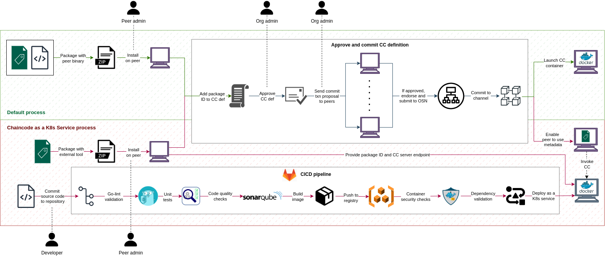

# Chaincode as a Kubernetes service (CCaaKS)

This project provides CICD resources to support the software life-cycle of
chaincode in Hyperledger Fabric.

## Life-cycle of a chaincode

The following diagram illustrates how the life-cycle of a chaincode is impacted by both
the default and CCaaKS processes.

    

